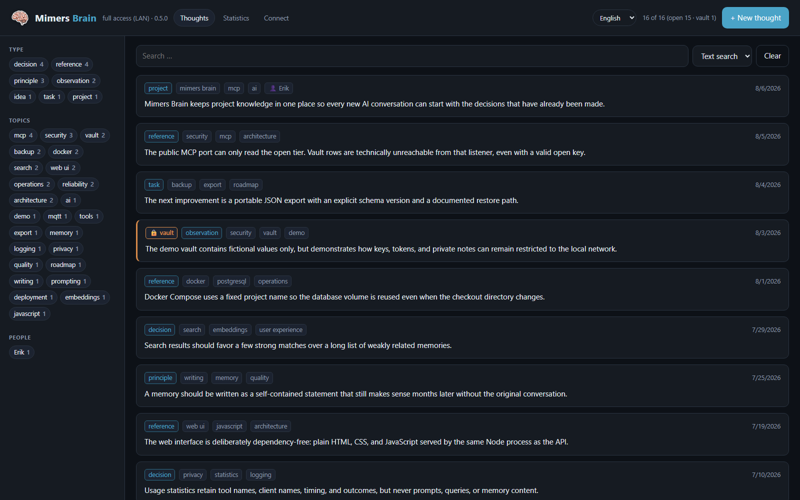
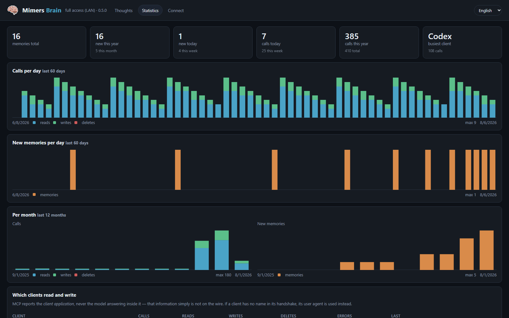

# Mimers Brain

*[Svenska](README.sv.md)*

A self-hosted long-term memory for language models. Same idea as
[OB1](https://github.com/NateBJones-Projects/OB1), but on your own hardware — and
with a tier that never leaves the local network.

Anything that speaks MCP can read and write the memory, so what you know about
your systems gets written down once instead of re-explained in every new
conversation. Secrets are served on the LAN only; everything else is reachable
from anywhere.

| | |
| --- | --- |
| **[HowToUse.md](HowToUse.md)** | Connecting a model, and rebuilding after a reinstall |
| **[history.md](history.md)** | What was built, why, and what went wrong |
| **[docs/nginx-brain.conf](docs/nginx-brain.conf)** | Ready-made reverse proxy config |
| **[migrate/](migrate/)** | One-time import of existing knowledge |

> **Addresses in the docs are placeholders.** `192.0.2.x`
> ([RFC 5737](https://www.rfc-editor.org/rfc/rfc5737)) and `example.net`
> ([RFC 2606](https://www.rfc-editor.org/rfc/rfc2606)) are reserved for
> documentation and resolve to nothing. Substitute your own. Keep the real values
> for a deployment in `docs/deployment.local.md`, which is gitignored.

## Screenshots





The web interface ships in English and Swedish, selects the browser language on
first visit, and remembers a manual choice. New translations are ordinary JSON
catalogs; see [docs/translations.md](docs/translations.md).

## Why two ports

The tier split does **not** work by inspecting `X-Forwarded-For`. Anyone can set
that header, so a single line would lift the entire vault. Instead the tier is a
property of the **listener**:

| Port | Contents | Who |
| --- | --- | --- |
| **8790** | open + vault, plus the web UI | LAN only. **Never proxy this one.** |
| **8791** | open tier only | The only port a reverse proxy should forward to |

The MCP server on 8791 is built without the ability to reach the vault — its
tools are constructed with `tiers = ['open']` and `delete_thought` is not
registered at all. No parameter, header or path changes that. An attacker who
gets past the proxy still only reaches open knowledge.

Guarded by `test-isolation.ps1` (22 checks, all green):

```powershell
powershell -ExecutionPolicy Bypass -File .\test-isolation.ps1
```

The tests cover: vault rows are invisible on the open port, secret content never
leaks, looking a vault row up by id is refused, writing to the vault from outside
is refused, statistics do not even reveal that the vault exists, the connection
guide withholds the vault key from the proxied listener, the usage log never
carries content, and a wrong key returns 401.

## Running it

```powershell
Copy-Item .env.example .env    # fill in POSTGRES_PASSWORD, MCP_ACCESS_KEY, OPENROUTER_API_KEY
docker compose up -d --build
```

The interface: <http://localhost:8790>

Generate a key:
```powershell
-join ((1..32) | ForEach-Object { '{0:x2}' -f (Get-Random -Maximum 256) })
```

**`OPENROUTER_API_KEY` is not optional in practice.** Without it nothing gets an
embedding, so neither semantic search nor `search_thoughts` works — only listing
and substring search.

## Connecting Claude Code

```bash
claude mcp add --transport http mimers-brain http://192.0.2.41:8790/mcp --header "Authorization: Bearer <MCP_ACCESS_KEY>"
```

From outside — and for other models — use the proxied hostname, which points at
8791. See [HowToUse.md](HowToUse.md) for every client.

## Authentication

Four ways in, in the order the server tries them:

1. **Bearer key** (`Authorization: Bearer <MCP_ACCESS_KEY>`) — what MCP clients
   and scripts use.
2. **Cookie** — the browser trades the key for an HttpOnly cookie once, via
   `POST /api/login`. It is derived from the key rather than stored, so there is
   no session table to maintain.
3. **Forward auth** (Authelia or similar) — on the open listener only. The proxy
   has already run the request past the authenticator and set `Remote-User`.
4. **URL key** (`/mcp?key=<MCP_OPEN_KEY>`) — open listener, `/mcp` only, and
   only if `MCP_OPEN_KEY` is set.

Points 3 and 4 are safe *there and only there*: that listener cannot reach vault
rows at all, so the worst a spoofed header or a leaked URL grants is open-tier
data anyone on the LAN could read from 8790 anyway. Never do the same on the full
listener.

Point 4 exists because some clients take a URL and offer no way to send a header
— Claude Desktop's connector dialog is the case that forced it. A credential in a
URL is a real downgrade: it is stored in the client's config and written to every
proxy access log, so `MCP_OPEN_KEY` must be a **different** value from
`MCP_ACCESS_KEY`, and `/mcp` has `access_log off` in
[docs/nginx-brain.conf](docs/nginx-brain.conf). The cleaner answer for that class
of client is OAuth, sketched but not built in
[docs/oidc-connector-plan.md](docs/oidc-connector-plan.md).

The UI is served on **both** ports. On 8790 you see the vault and sign in with
the key; through the proxy you see the open tier and the authenticator handles
sign-in.

## The web interface

Three views, and the sign-in described above covers all of them.

**Memories** is the list, the search and the tag editing.

**Connect** is the setup instructions for every client — Claude Code, Codex in VS
Code, the Claude Desktop connector, Open WebUI, ChatGPT, a generic MCP client —
rendered with *this* instance's addresses, keys and tool list rather than
placeholders. Copy buttons hand over ready-made commands and JSON.

Keys are masked until you ask for them, and one rule decides which are on the
page at all: `MCP_ACCESS_KEY` is served **only by the LAN listener**. Reaching
the UI through the proxy means the authenticator let you in, but sending the
vault key that way would push the one credential that unlocks the vault out of
the house and into a browser cache on every visit. `MCP_OPEN_KEY` is shown on
both, since it is designed to travel in URLs and can only ever reach open
knowledge.

The LAN address on that page is **learned, not configured**. Asking the OS for it
from inside a container returns Docker's bridge address, and so does the socket,
since the port is NAT'd — both would confidently print an address that works for
nobody. The `Host` header on the LAN listener cannot be wrong in the way that
matters, though: it is an address a browser just reached us on. So it is taken
from real visits and stored, which is why the page can still name the LAN address
when you are reading it through the proxy. `LAN_URL` overrides it if you would
rather see a hostname; until the LAN listener has been opened once, the page says
so rather than guessing.

**Statistics** answers who uses the memory and how much: calls per day, month and
year, new memories over the same spans, and a breakdown per client and per tool.

Two things worth knowing about those numbers. MCP identifies the **client
application** — Claude Code, Codex, a ChatGPT connector — and never the model
answering inside it; a model name is not on the wire, so the page does not
pretend to know one. And the usage log holds no content: not the search query,
not the memory, not the result. A traffic log that quoted vault searches back
would undo the tier split it sits behind. Through the proxy the page counts only
traffic that arrived on the open listener, so it cannot reveal that vault traffic
exists either.

## Home Assistant over MQTT

Set `MQTT_URL` in `.env` and the brain announces itself through HA discovery as
the device **Mimers Brain**, then publishes its counters every `MQTT_INTERVAL_S`
seconds and immediately after every write.

Entity ids follow from the device name plus each sensor name — not from
`object_id`, whatever the docs suggest — so they are a contract worth treating as
one:

| Entity | What |
| --- | --- |
| `binary_sensor.mimers_brain_online` | connectivity, driven by the last will |
| `sensor.mimers_brain_memories_total` / `_open` / `_vault` | size of the memory |
| `sensor.mimers_brain_memories_today` / `_week` / `_month` / `_year` | growth |
| `sensor.mimers_brain_calls_today` / `_week` / `_month` / `_year` / `_total` | traffic |
| `sensor.mimers_brain_reads_today`, `_writes_today` | traffic split |
| `sensor.mimers_brain_clients_week`, `_top_client` | who is using it |
| `sensor.mimers_brain_last_memory`, `_last_call` | timestamps |
| `sensor.mimers_brain_status`, `_problem` | `ok` / `degraded` / `error`, and why |
| `sensor.mimers_brain_uptime` | seconds since start |

Every sensor reads from one retained JSON payload on `<prefix>/state`, so Home
Assistant repopulates all of them from a single message after a restart instead
of showing `unknown` until the next tick.

The availability topic carries a **last will**, which is the part that makes
"is it alive" honest: if the process dies, the broker publishes `offline` on its
behalf. Without one, a dead brain looks exactly like a healthy one with nothing
new to say. A planned stop says `offline` deliberately, so a restart reads as a
short blip rather than a stuck `online`.

`sensor.mimers_brain_problem` is read on an ESPHome wall display whose fonts carry
a fixed glyph list, so the text is sanitised against that vocabulary before it is
published — a character outside the list draws as *nothing*, with no fallback box,
and silently eats part of the sentence. That is why faults are separated by `/`
and not `|`. The list is a copy of the `glyphs:` line in the device YAML; if that
changes, `DISPLAY_GLYPHS` in `server/mqtt.mjs` follows.

Counters only. No memory content and no search queries go on the broker — the
broker is on the LAN, but that is not a reason to publish something that did not
need publishing. The vault *count* does go out, which is worth knowing if the
broker is shared.

The broker password lives in `.env` next to the other secrets rather than in a
settings table, deliberately: the database is dumped nightly, and a credential
that can be changed with one `docker compose up -d` does not need to be in
backups too.

## Docker inside an LXC

An unprivileged Proxmox LXC cannot apply an AppArmor profile, so every container
start fails with `runc run failed: unable to apply apparmor profile`. It shows up
deviously as an `npm install` failure mid-build — read the whole log for
`runc run failed` before debugging npm.

`security_opt: [apparmor=unconfined]` in the compose file fixes **running**, and
is harmless on machines without the problem. **Building** cannot be fixed from
inside (neither BuildKit nor `DOCKER_BUILDKIT=0` accepts `--security-opt`).

**The proper fix is on the Proxmox host**, not in the container: add
`lxc.apparmor.profile: unconfined` to `/etc/pve/lxc/<vmid>.conf`, check that
`features: nesting=1` is set, and reboot the container. Then
`docker compose up -d --build` works on the server directly.

## Deploying

1. Create an LXC (Debian or Ubuntu, 2 vCPU, 2 GB RAM, 20 GB disk is plenty —
   pgvector with a few thousand memories is small).
2. Install Docker, clone the repo, fill in `.env`, `docker compose up -d --build`.
3. Point a reverse proxy host at `http://<lxc-ip>:8791`. **Check that it says
   8791 and not 8790.**
4. If you put an authenticator in front: MCP clients cannot complete an
   interactive login, so `/mcp` needs a bypass — the bearer key is the protection
   there. `/.well-known/oauth-*` needs one too, answering **404**: behind forward
   auth it redirects to a login page that answers 200, and a client probing for
   OAuth reads that as an authorization server it must register with. See
   [docs/nginx-brain.conf](docs/nginx-brain.conf).

## Backups

`backup.sh` runs a nightly `pg_dump`, gzips it, and keeps ten days. It verifies
that the dump is valid gzip **and** contains the thoughts data before rotating
anything out — a truncated dump must never push a working one off the end.

```
10 0 * * * /path/to/mimers-brain/backup.sh >> /path/to/backups/backup.log 2>&1
```

A logical dump complements a full VM or container backup rather than duplicating
it: it can be restored selectively — a single thought, or the table into a fresh
database — which an image cannot do.

## Schema

The same shape as OB1's `thoughts` table plus `tier`, which keeps migration
trivial and the metadata format identical (`type`, `topics`, `people`).

One detail in `upsert_thought`: a row can be **promoted** into the vault but
never silently fall out of it. Capturing the same content again with
`tier='open'` leaves the row as `vault`.

## Naming

Container names, the Docker volume, and the compose project are `valv`-prefixed
(Swedish for *vault*), left over from when the project was called Mimers Valv.
They are deliberately untouched: `name: mimers-valv` is pinned at the top of
`docker-compose.yml` because Compose otherwise derives the project name from the
directory, and the volume holding every memory is `mimers-valv_valv-data`. A
rename would silently create a fresh, empty database.
